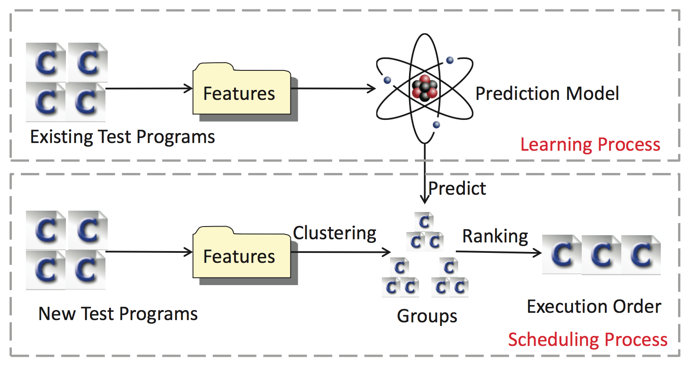

Learning to Test - Accelerating C Compiler Testing
---
*update:2015-08-30 under_construction*  
[1.Intro](#1) [2.Featrue](#2) [3.Result](#3) [4.Contribution](#4) [5.Reference](#5)
###<h2 id="1">Intro</h2>
We propose the idea of learning to test, meaning to learn from previous test cases that trigger bugs and use the learned model to prioritize new test cases. Based on this idea, to accelerate C compiler testing, we propose LET, a learning-to-test approach, which consists of the learning process and scheduling process. Certain processes's illustrations are as follows.

###<h2 id="2">Features</h2>
Following link will lead you to download the Feature Description file of our study.   
[DownlaodLink](./file/l2t.features.pdf)  
###<h2 id="3"> Result </h2>
Following link will lead you to download the RESULT file of our study, including a README file to explain the detail.   
[DownlaodLink](./file/l2t.result.zip)   